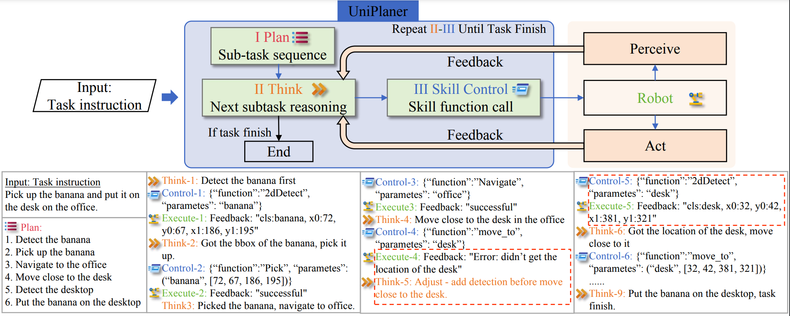

# UniPlanner: An Efficient and Unified Embodied Task Planner for Edge Devices




**UniPlanner** is a task planner that reduces the high latency and computational costs of large language models (LLMs). Instead of using multiple agents for subtask planning and control, it uses a single lightweight LLM to handle everything in one context until the task is complete. This reduces system complexity and avoids the need for communication with cloud servers, lowering latency. UniPlanner performs efficiently on devices like the **Jetson Xavier Orin**, making it ideal for low-resource environments.

### Features:
- **Single lightweight LLM** for task planning and control.
- Handles task sequences, skill control, and adjustments in **one context**.
- **No multiple agents, no cloud communication**.
- Low latency and high efficiency on edge devices like **Jetson Xavier Orin**.

[TOC]

## Installation

You can install it on a linux pc, if you need to run it on the Jetson platform, make sure you have CUDA and cuDNN installed on your Jetson device and have PyTorch installed.

To install UniPlanner, follow these steps:

1. Clone the repository:
   ```
   git clone https://github.com/unira-zwj/uniplan.git
   ```

2. Install the required dependencies:
   ```
   pip install -r requirements.txt
   ```

## Before start


**Hardware connection**
- If your robot is a UR + Robotiq (all UR models are supported), you need to connect the UR robot's network cable to the Jetson (or PC)
- Plug the Robotiq's USB cable into the Jetson (or PC).
- The USB of the Inter D435 camera needs to be connected to the USB 3.0 port of the Jetson (or PC).
- Our code implements the eye-in-hand approach, so the end-effector of the UR robotic arm needs to be aligned with the camera. And set up your robot's coordinate transformation matrix in the software setup way below.
- Theoretically the code is compatible with the eye-out-of-hand mounting, but it's a good idea to check that the coordinate changes are correct!

**Software Settings**
- You need to set the IP address of the UR robot to 192.168.0.1, and the IP address of the Jetson (or PC) to 192.168.0.2 (or you can set it to something else, you need to make sure that the network segment of the UR robotic arm is the same as the host)
- Query the Robotiq's tty device number (usually ‘/dev/ttyUSB0’)
- Set up the coordinate transformation matrix of the end-effector of the UR robot arm and the camera, you can find the corresponding settings in line 19 of uniplan.py.
```python
R_C_to_T = np.eye(3)  # Rotation from camera to tool
t_C_to_T = np.array([-0.038, -0.065, -0.135])  # Translation from camera to tool
```
- Set the Home start point of your robot, this is the initial position of the arm, you must try to make sure that the end of the arm is perpendicular to the table plane or parallel to the table plane, you can find the corresponding settings in uniplan.py on line 16
```python
HOME_POSE = [-0.025, -0.32, 0.2, 0, 3.133, 0] # Work on vertical down tasks (e.g. desktop grabbing)
HOME_POSE_H = [-0.025, -0.48, 0.15, 0, 2.24, -2.16] # Tasks working in horizontal operation (e.g. opening and closing drawers)
```

**Check that the settings in the code match**
- Lines 39 and 40 in uniplan.py need to be set to the IP address of your UR robot arm and the Robotiq tty device number
```python
self.Robot = UR3("192.168.0.1")
self.Gripper = Robotiq85(MODBUS_PORT='/dev/ttyUSB0', BAUDRATE=115200)
```

**Model Download**
- Download link: 🔗
- You need to change the model path in line 9 of uniplanner_llm.py to the path of the model you downloaded

## Quickstart

To use UniPlanner, follow these steps:

1. run the planner_llm:
   ```python
   $ python uniplanner_llm.py
   ```

2. run the planner:
   ```python
   $ python uniplan.py
   ```

## Other details
- The definitions of the skill functions mentioned in the machine article are in `. /uniplanner/skill_functions.py`.
- The implementation of the skills for the robots is in the `. /robot_skills/` directory.
- The base api for the robot is in the `. /robot_base_api/ `. Theoretically, you can just change the api for any robot, no matter what model you have.