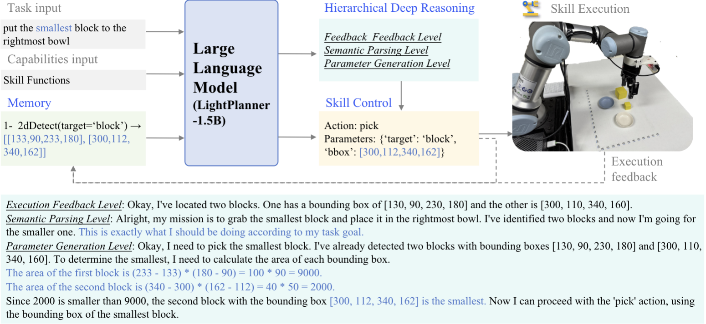

<div align="center">

# Welcome to LightPlanner

</div>

📖 **LightPlanner: Unleashing the Reasoning Capabilities of Lightweight Large Language Models in Task Planning**

<!--  -->


## Release

- [x] **`2025.03.08`** 🔥Release the Data and the Model at [🤗Hugging face](https://huggingface.co/elonzhou/LightPlanner-qwen2.5-1.5B).
- [x] 🔥Release the LightPlanner code.

## Supplementary details

- [x] Train dataset (LightPlan-40k) in ： `LighPlan-40k-dataset/lightplan40k-v2.json`
- [x] All skill functions used in training dataset in ： `lightplanner/skill_functions.py`
- [x] LightPlanner Training code follow: [LLaMA-Factory](https://github.com/hiyouga/LLaMA-Factory/tree/main)
- [x] Model download: [🤗Hugging face link](https://huggingface.co/elonzhou/LightPlanner-qwen2.5-1.5B)


## Installation

You can install it on a linux pc, if you need to run it on the Jetson platform, make sure you have CUDA and cuDNN installed on your Jetson device and have PyTorch installed.

To install LightPlanner, follow these steps:

1. Clone the repository:

   ```
   git clone https://github.com/unira-zwj/LightPlanner.git
   ```
2. Install the required dependencies:

   ```
   fastapi, pydantic, transformers, torch, asyncio, gradio, re
   ```

if you use UR robot, you need to install `urx`

## Before start

<div align=center> </div>


**Hardware connection**

1. If your robot is a UR + Robotiq (all UR models are supported), you need to connect the UR robot's network cable to the Jetson (or PC)
2. Plug the Robotiq's USB cable into the Jetson (or PC).
3. The USB of the Inter D435 camera needs to be connected to the USB 3.0 port of the Jetson (or PC).
4. Our code implements the eye-in-hand approach, so the end-effector of the UR robotic arm needs to be aligned with the camera. And set up your robot's coordinate transformation matrix in the software setup way below.
5. Theoretically the code is compatible with the eye-out-of-hand mounting, but it's a good idea to check that the coordinate changes are correct!

**Software Settings**

1. You need to set the IP address of the UR robot to 192.168.0.1, and the IP address of the Jetson (or PC) to 192.168.0.2 (or you can set it to something else, you need to make sure that the network segment of the UR robotic arm is the same as the host)
2. Query the Robotiq's tty device number (usually ‘/dev/ttyUSB0’)
3. Set up the coordinate transformation matrix of the end-effector of the UR robot arm and the camera, you can find the corresponding settings in line 110 of lightplanner_callback_v2.py.

```python
R_C_to_T = np.eye(3)  # Rotation from camera to tool
t_C_to_T = np.array([-0.038, -0.065, -0.135])  # Translation from camera to tool
```

4. Set the Home start point of your robot, this is the initial position of the arm, you must try to make sure that the end of the arm is perpendicular to the table plane or parallel to the table plane, you can find the corresponding settings in lightplanner_callback_v2.py on line 106

```python
HOME_POSE = [-0.025, -0.32, 0.2, 0, 3.133, 0] # Work on vertical down tasks (e.g. desktop grabbing)
HOME_POSE_H = [-0.025, -0.48, 0.15, 0, 2.24, -2.16] # Tasks working in horizontal operation (e.g. opening and closing drawers)
```

**Check that the settings in the code match**

1. Lines 122 in lightplanner_callback_v2.py need to be set to the IP address of your UR robot arm and the Robotiq tty device number

```python
self.Robot = UR3("192.168.0.1")
self.Gripper = Robotiq85(MODBUS_PORT='/dev/ttyUSB0', BAUDRATE=115200)
```

**Model Download**

- Download link: [🤗Hugging face link](https://huggingface.co/elonzhou/LightPlanner-qwen2.5-1.5B)
- You need to move the files of the model to `checkpoints`, or change the model path in line 24 of llm-serve.py to the path of the model you downloaded

## Quickstart

To use LightPlanner, follow these steps:
```python
$ uvicorn llm-serve:app --host 0.0.0.0 --port 8000
$ python web-v2.py
```


## Other details

- The implementation of the skills for the robots is in the `./lightplanner/robot_skills/` directory.
- The base api for the robot is in the `./lightplanner/robot_base_api/ `. Theoretically, you can just change the api for any robot, no matter what model you have.
